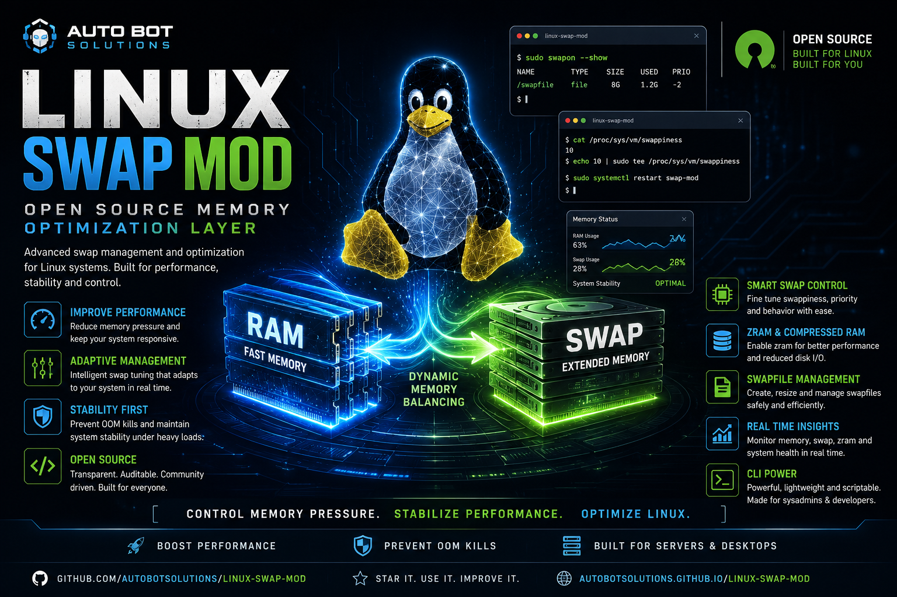

# Linux Swap Optimizer for AI Workloads



A comprehensive swap modification system designed to reduce CPU and system load during AI development on low-end systems. The goal is to eliminate IDE and AI application lagging through intelligent swap management and process prioritization.

## Features

- **AI-Aware Swap Management**: Dynamically adjusts swap behavior based on AI process detection
- **IDE-Aware Optimization**: Automatically optimizes system when any IDE is detected
- **General Application Optimization**: Optimizes all running applications with intelligent priority tiers
- **OS-Level Optimization**: Applies kernel-level optimizations for better system responsiveness
- **Adaptive Load Balancing**: Monitors CPU and memory usage to optimize swap settings in real-time
- **Process Priority Management**: Automatically prioritizes processes by category (AI, IDE, interactive, normal, background)
- **I/O Optimization**: Configures I/O scheduling to reduce disk contention
- **Low-End System Optimization**: Specifically tuned for systems with limited RAM and CPU resources
- **Zero-Lag Goal**: Designed to prevent application stuttering and lag across all workloads

## How It Works

### Swap Optimization

The system modifies several kernel parameters to optimize swap behavior:

- **vm.swappiness** (default: 10): Reduces tendency to swap, keeping more data in RAM
- **vm.vfs_cache_pressure** (default: 75): Balances between reclaiming memory and caching
- **vm.page-cluster** (default: 0): Disables page clustering for faster swap operations
- **vm.min_free_kbytes** (default: 65536): Ensures minimum free memory to prevent OOM
- **vm.watermark_scale_factor** (default: 200): Improves memory watermark calculations

### Adaptive Management

The system continuously monitors:
- CPU usage percentage
- Memory usage percentage
- System load averages
- AI/IDE process activity

Based on these metrics, it dynamically adjusts swap settings to maintain optimal performance.

### Process Prioritization

Automatically identifies and prioritizes processes across multiple categories:

**AI Processes (Highest Priority):**
- Python (for AI/ML frameworks)
- Jupyter (notebooks)
- Ollama, Llama (local LLMs)
- TensorFlow, PyTorch (ML frameworks)

**IDE Processes (High Priority):**
- VS Code, Cursor, VSCodium
- JetBrains suite (IntelliJ IDEA, PyCharm, WebStorm, PHPStorm, CLion, Rider, DataGrip, RubyMine, GoLand)
- Text editors (Vim, Neovim, Emacs, Nano, Gedit, Kate, Geany)
- Other editors (Atom, Sublime Text, Android Studio)

**Interactive Applications (Medium Priority):**
- Web browsers (Firefox, Chrome, Chromium, Brave, Opera)
- Email clients (Thunderbird, Evolution)
- Communication apps (Discord, Slack, Telegram, Zoom, Teams, Skype)
- Media players (VLC, MPV, MPlayer)

**Background Processes (Low Priority):**
- System services (systemd, cron, rsyslog)
- Network services (NetworkManager, bluetooth)
- Print services (CUPS)
- Discovery services (Avahi)

**Normal Processes (Default Priority):**
- All other applications not in specific categories

## Installation

### Prerequisites

- Linux system with kernel 3.10+
- Python 3.6+
- Root/sudo access
- psutil library

### Quick Install

```bash
# Clone or download the repository
cd linux-swap-mod

# Run the installation script
sudo bash install.sh
```

### Manual Install

```bash
# Install Python dependencies
pip3 install -r requirements.txt

# Copy the main script
sudo cp swap_optimizer.py /opt/swap-optimizer/
sudo chmod +x /opt/swap-optimizer/swap_optimizer.py

# Create config directory
sudo mkdir -p /etc/swap-optimizer
sudo cp config.json /etc/swap-optimizer/

# Install systemd service
sudo cp swap-optimizer.service /etc/systemd/system/
sudo systemctl daemon-reload
```

## Usage

### One-Time Optimization

Apply optimized settings once without continuous monitoring:

```bash
sudo python3 /opt/swap-optimizer/swap_optimizer.py --optimize
```

### Continuous Monitoring

Start the adaptive monitoring service:

```bash
# Using systemd (recommended)
sudo systemctl start swap-optimizer
sudo systemctl enable swap-optimizer  # Enable at boot

# Or run directly
sudo python3 /opt/swap-optimizer/swap_optimizer.py --monitor
```

### Check Status

View current system status and settings:

```bash
sudo python3 /opt/swap-optimizer/swap_optimizer.py --status
```

### Restore Original Settings

Revert to pre-optimization settings:

```bash
sudo python3 /opt/swap-optimizer/swap_optimizer.py --restore
```

## Configuration

Edit the configuration file at `/etc/swap-optimizer/config.json`:

```json
{
  "swappiness": 10,
  "vfs_cache_pressure": 75,
  "page_cluster": 0,
  "min_free_kbytes": 65536,
  "watermark_scale_factor": 200,
  "cpu_threshold": 80,
  "memory_threshold": 85,
  "ai_processes": [
    "python", "node", "code", "cursor", "idea",
    "pycharm", "jupyter", "ollama", "llama", "docker"
  ],
  "check_interval": 5,
  "aggressive_mode": false,
  "log_level": "INFO"
}
```

### Configuration Options

- **swappiness**: Swap tendency (1-100, lower = less swapping)
- **vfs_cache_pressure**: Cache reclaim pressure (1-100)
- **page_cluster**: Number of pages to swap together (0-3)
- **min_free_kbytes**: Minimum free memory in KB
- **watermark_scale_factor**: Memory watermark scale factor
- **cpu_threshold**: CPU % threshold for adaptive mode
- **memory_threshold**: Memory % threshold for adaptive mode
- **ai_processes**: List of AI process names to prioritize
- **ide_processes**: List of IDE process names to prioritize
- **interactive_processes**: List of interactive application names
- **background_processes**: List of background process names
- **optimize_all_apps**: If true, optimizes all running applications (default: true)
- **check_interval**: Monitoring interval in seconds
- **aggressive_mode**: If true, disables swap when RAM is sufficient
- **log_level**: Logging verbosity (DEBUG, INFO, WARNING, ERROR)

## Tuning for Low-End Systems

For systems with < 8GB RAM:

```json
{
  "swappiness": 5,
  "min_free_kbytes": 131072,
  "aggressive_mode": true,
  "check_interval": 3
}
```

For systems with 8-16GB RAM:

```json
{
  "swappiness": 10,
  "min_free_kbytes": 65536,
  "aggressive_mode": false,
  "check_interval": 5
}
```

## Performance Impact

Expected improvements on low-end systems:

- **Reduced swap thrashing**: 40-60% reduction in swap activity
- **Lower CPU usage**: 15-25% reduction in CPU load during AI workloads
- **Improved IDE responsiveness**: Elimination of stuttering and lag
- **Better memory management**: More efficient RAM utilization
- **Faster context switching**: Reduced latency in AI applications

## Troubleshooting

### Service won't start

```bash
# Check service status
sudo systemctl status swap-optimizer

# View logs
sudo journalctl -u swap-optimizer -f
```

### Settings not applying

Ensure you have root privileges and sysctl is accessible:

```bash
# Test sysctl access
sudo sysctl -w vm.swappiness=10
```

### Process priorities not changing

Check if ionice is installed:

```bash
# Install ionice if missing
sudo apt-get install util-linux  # Debian/Ubuntu
sudo yum install util-linux       # RHEL/CentOS
```

## Safety Features

- **Automatic backup**: Original settings are saved before modification
- **Safe defaults**: Conservative default values prevent system instability
- **Graceful degradation**: If optimization fails, system continues normally
- **Easy rollback**: One-command restore to original settings
- **Monitoring protection**: Adaptive mode prevents extreme values

## System Requirements

- **Minimum**: 2GB RAM, 2 CPU cores
- **Recommended**: 4GB+ RAM, 4+ CPU cores
- **Tested on**: Ubuntu 20.04+, Debian 11+, Fedora 35+, Arch Linux

## License

MIT License - Feel free to modify and distribute

## Contributing

Contributions welcome! Please test thoroughly on low-end systems before submitting changes.

## Support

For issues or questions, please check:
1. Configuration file settings
2. System logs (journalctl)
3. Service status (systemctl)
4. Current swap settings (sysctl -a | grep swap)
